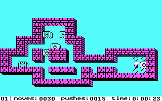
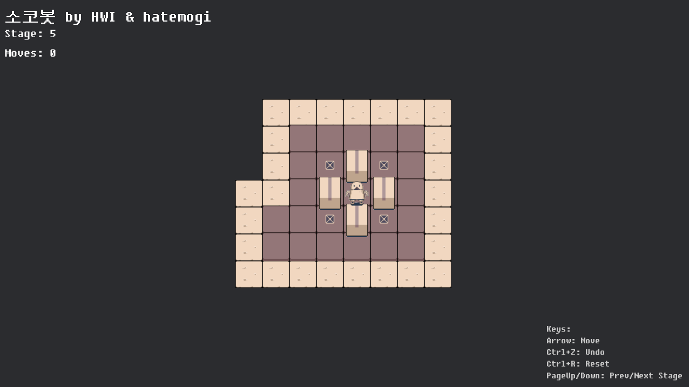
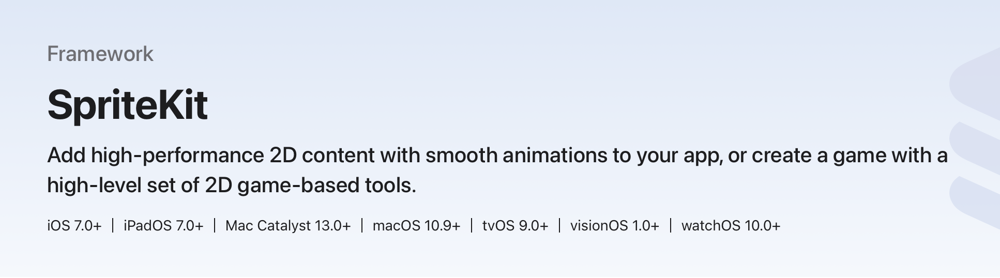

## Goals

* 앱 소개
* 하고싶은 이야기 썰
* 배운점 공유
* 내가 나아갈 방향 다짐 
* 오랜만에 미디엄 포스트 인사

## What I Learned

* SpriteKit
* XCode와 Claude, Gemini, 그리고 Codex
* 개발자의 역할과 디자이너 역할, 그 공백점들
* 내 성향을 돌이켜 보고 잘 이용하기
* 불안과 걱정은 극복 대상이 아니라 함께 가야 할 대상

## What I Suggest

* Action Oriented
* Don't think too much
* Don't expect too much
* Consistency is the key
* What is right and wrong is not important as you think.
* 내가 할 수 있는 일에 집중하기

# 첫 게임 앱을 출시하며 배운 점 - Elephant 개발기 (0)

## 첫 게임 앱 출시

제 직업적 정체성을 말하자면 아마도 저는 백엔드 개발자일 텐데요, 그 정체성과는 꽤 다르게도 이번에 아이폰/아이패드용 퍼즐 게임을 만들어 출시했습니다. 그야말로 갑자기요. 어려서부터 게임을 만들어 보고 싶었고, 또 그간 몇몇 광고 수익 기반 서비스 회사를 다니다 보니 유료 앱이나 서비스에 대한 갈망(?)이 있었던 거 같아요. 

## 게임 제작자 지인의 중도포기작

동네 도서관에 갔다가, 신간도서 코너에서 게임 프로그래밍에 관한 책을 발견했습니다. 책 제목을 보고 있노라니 어려서 게임을 만들어보려 했다는 기억이 되살아나더라고요. 마침, 퇴사 후 한가하던 타이밍이라, 친한 게임 제작자 지인에게 가서 물어봤습니다. "혹시 작업하다가 버려둔 프로젝트 없어요?" 별 기대 없이 물었는데, 마침 오래전에 '소코반' 아류작을 만들려다가 버려둔 이미지 셋이 있다고 답하지 뭡니까? 

사실은 2D 슈팅 게임을 만들어보고 싶었던 상황이라, 퍼즐 게임이라는 점은 조금 아쉬웠지만, 그래도 오히려 만들기는 쉽겠다는 생각이 들었습니다. 그래픽이 화려하거나 이동이 빠르지는 않아도 될 테니, 저 같은 초보자가 성능 고민 없이 개발하기엔 딱 맞을 수도 있겠다 싶었죠. 

예전 애셋들 찾아서 보내주겠다 합니다. 그럼 전 그걸 받아서 개발만 하면 되겠다는 희망을 품었죠.

## 소코반

소코반은 저 어릴 적 했던 게임입니다. 일본어고, 뜻은 아마 '창고지기'일 거예요. 창고를 지키는 사람이요. 게임의 내용은, 창고지기가 창고 안에 있는 상자들을 밀어서 정해진 목표 위치에 놓는 퍼즐 게임입니다. 상자를 하나씩 밀 수는 있지만 당길 수는 없어요. 또 상자를 밀려면 플레이어가 빈 공간으로 먼저 가서 상자를 밀어야 하기 때문에 벽에 붙은 상자를 그냥 꺼낼 수는 없다는 규칙이 있습니다. 단순한 규칙의 이 게임이 당시에는 꽤 흥행했기에, 다양한 아류작들이 다양한 플랫폼으로 출시됐고, 꽤 마니아 층도 있어서, 일반 유저들이 이 퍼즐 맵을 만드는 사람들도 있게 됩니다. 저는 아마 애플IIe에서 해봤던 거 같아요.

> 일본의 소프트웨어 업체인 '씽킹 래빗(Thinking Rabbit)'에서 제작해 1982년에 처음 낸 퍼즐 게임으로, 개발자는 동사의 사장이었던 이마바야시 히로유키(今林宏行). 해외에서도 상당한 지명도가 있어 타이틀인 '소코반'은 영어로도 따로 번역하지 않고 'SOKOBAN'으로 그대로 쓰며, 한국에도 이 이름으로 흔히 알려져 있다. 원래는 일본어 '倉庫番'(そうこばん)인데, 이는 창고지기라는 뜻이다. -- 나무위키

## 처음엔 Rust로 개발하다

마침, 제가 최근 몇 년 러스트로 개발하면서 강의도 제작해서 판매하고 있을 정도였기에, 처음 시작은 러스트로 했습니다. 러스트 기반의 게임 엔진인 bevy를 선택해서 개발하기 시작했죠. bevy로도 iOS나 안드로이드를 타겟으로 배포할 수 있다기에 무난한 선택이었습니다. 어차피 제가 Unity 같은 전문 게임제작 도구를 쓸 줄 아는 상황이 아닌지라 바닥부터 하면 되고, 러스트로 개발하기에 큰 부담은 없는 상황이었으니까요. 암튼 그렇게, 지인이 준 이미지 애셋 일부를 활용해서 웹에서 실행할 수 있을 정도로 구현했습니다. 이때만 하더라도, 깃허브 코파일럿이 보조적으로 코딩을 도와주던 정도였는데, 그 사이에 클로드 코드를 중심으로 세상이 확 변해버렸습니다.

### 짤막 Rust 강의 홍보

<https://inf.run/LPYW>

인프런 러스트 강의 30% 할인 쿠폰: 17514-f2f5f26f75f4

## 웹어셈블리 버전 로딩타임

<https://sokobot.hatemogi.com>

그렇게 프로토타입을 웹에 배포해 봤습니다. 모바일에서는 너무 느려서 로딩조차 어려운 수준이었고, 데스크톱에서는 일단 플레이는 가능하게 만들었어요. 초기 로딩 시간이 길어서 아쉬웠지만, 일단 로딩되면 쾌적한 속도가 나쁘지 않았어요. 게임 제작자 지인 H가 처음에 전달해준 애셋을 입혀서 만들었습니다.

그럭저럭 프로토타입으로써는 괜찮다는 느낌이 있었지만, 웹 버전으로는 조금 아쉬운 느낌이 있었습니다. 이제 본판 모바일 버전은 뭐로 만들지 고민이 시작됐습니다. 

## 모바일 버전은 뭘로 만들까? 

아래의 후보로 고민해 봤습니다. 

1. bevy엔진으로 아이폰 모바일 버전 구현 도전
2. Unity/Unreal 엔진을 배워서 도전
3. iOS 네이티브 버전으로 SpriteKit 활용

1번이나 2번으로 하게 되면, 아마 안드로이드 버전도 큰 어려움 없이 구현할 수 있을 거라는 기대가 들었죠. bevy엔진은 러스트 개발자로서 꽤 매력적인 선택이긴 하지만, 아이폰 모바일 버전 구현에서 마주치게 될 의외의 허들들이 걱정되었습니다. 아마 어떻게 어떻게 해결을 할 수야 있겠지만, 분명 복병들이 곳곳에 있겠죠.

2번의 경우에는, 대부분의 게임 개발자들이 활용하는 검증된 플랫폼이니 게임개발을 계속 하려한다면 이참에 입문하는 것도 나쁘지 않은 선택같았습니다. 제 경우에는 2D게임이 주요목표이니 언리얼 엔진보다는 유니티가 더 나을 거라는 챗GPT의 추천이 있었습니다. 

3번은, 사실 흔히 하기 어려운 선택인 거 같습니다. 모바일 게임을 개발하는 사람들이 안드로이드 플랫폼을 포기하기가 쉽지 않은데, 아이폰 전용의 프레임워크를 쓴다? 게다가 그마저도 자료가 많지 않다? 어려운 선택이죠.

## 스프라이트킷

스프라이트킷은 애플의 장치들에서 2차원 그림, 파티클, 텍스트, 이미지, 비디오 등을 그릴 때 쓰는 일반 용도의 프레임워크입니다. 일반 용도라 함은, 꼭 게임이 아니어도 된다는 얘기인데, 그러면서도 물리엔진도 들어있는 거 보면, 게임을 겨냥한 프레임워크이긴 한 거 같습니다.

> SpriteKit is a general-purpose framework for drawing shapes, particles, text, images, and video in two dimensions. It leverages Metal to achieve high-performance rendering, while offering a simple programming interface to make it easy to create games and other graphics-intensive apps. Using a rich set of animations and physics behaviors, you can quickly add life to your visual elements and gracefully transition between screens.

아무튼, 제가 만들고자 하는 2차원 퍼즐 게임 같은 경우에, 이 스프라이트킷이 꽤 적절하게 활용할 수 있겠다는 기대가 들었습니다. 아쉬운 건 안드로이드 플랫폼에는 별도로 새로 개발해야 한다는 점인데, 그건 나중에 고민해 보기로 합니다. 일단 전 안드로이드 장비가 없을뿐더러 당장 구매할 생각도 없거든요. 오래전에 비슷한 이유로 샤오미 안드로이드 폰을 샀었는데, 괜히 돈만 낭비했던 경험이 있습니다.

이번 개발의 최우선 목표는, "최대한 간단하게 개발해서 공개한다"는 점이었으므로, 가장 단순한 프레임워크나 개발환경을 선택하는 것이 중요했습니다. 그런 목표 아래에서는 오로지 아이폰만을 목표로 하는 것도 좋은 선택이었습니다
