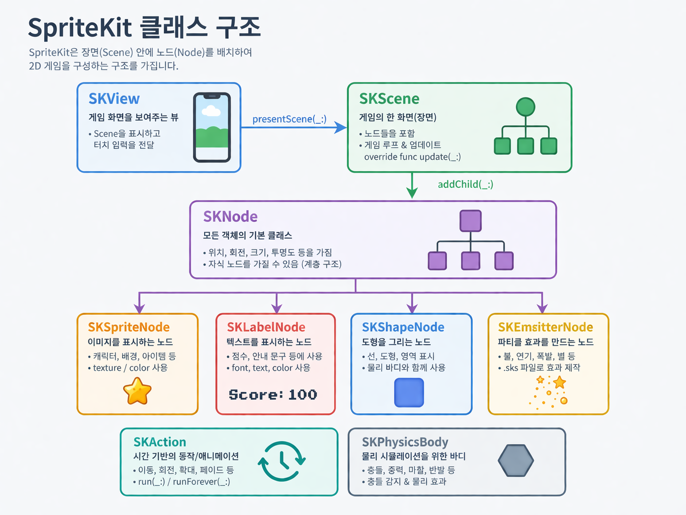
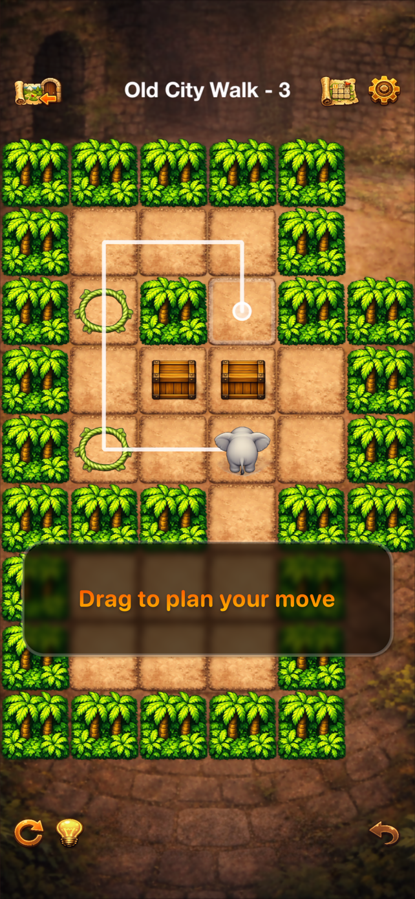

# SpriteKit 소개 - 첫 게임 앱을 출시하며 배운 점 (2)
⸻

iPhone에서 돌아가는 작은 2D 게임을 하나 만들어보고 싶다면, 생각보다 괜찮은 선택지가 있습니다. 바로 SpriteKit입니다.
SpriteKit은 Apple이 제공하는 2D 게임 프레임워크인데, Swift와 함께 사용하기 좋고 Xcode와도 잘 연결되어 있어서, 비교적 부담 없이 게임 제작을 시작해 볼 수 있습니다.

게임 엔진이라고 하면 보통 Unity나 Unreal 같은 큰 도구부터 떠올리기 쉽습니다. 물론 그런 엔진들은 강력하지만, 처음부터 너무 큰 도구를 잡으면 오히려 간단한 게임 하나를 만드는 일도 무겁게 느껴질 수 있습니다. 반면 SpriteKit은 Apple 플랫폼에서 2D 게임을 만드는 데 필요한 핵심 기능을 단순한 형태로 제공합니다.
퍼즐 게임, 간단한 아케이드 게임, 탭 중심 미니 게임처럼 규모가 크지 않은 프로젝트라면 특히 잘 어울립니다.

이 글에서는 SpriteKit이 어떤 프레임워크인지, 어떤 구조로 게임을 만들게 되는지, 그리고 왜 입문용으로 꽤 괜찮은 선택인지 가볍게 정리해 보려 합니다.

## SpriteKit은 무엇인가?

SpriteKit은 Apple이 만든 2D 그래픽 및 게임 프레임워크입니다.
쉽게 말하면, 화면에 캐릭터와 배경을 올리고, 움직이고, 충돌을 처리하고, 애니메이션을 처리하는 일을 편하게 해주는 도구입니다.

예를 들어 2D 게임을 만든다고 하면 보통 이런 일을 해야 합니다.

*	캐릭터나 배경 이미지를 화면에 배치하기
*	터치 입력 받기
*	특정 오브젝트를 움직이기
*	충돌을 판단하기
*	간단한 물리 효과 넣기
*	장면 전환하기
*	사운드나 애니메이션 붙이기

SpriteKit은 이런 기능들을 기본으로 제공합니다. 그래서 개발자는 아주 낮은 수준부터 그래픽 처리나 게임 루프를 직접 만들지 않아도 됩니다.
특히 Swift로 앱 개발을 해본 사람이라면, “완전히 다른 세계”라기보다 익숙한 Apple 개발 환경 위에서 게임 쪽 기능이 확장된 느낌으로 배워서 쓰기 좋습니다.

## 어떤 게임에 잘 맞을까?

SpriteKit은 이름 그대로 스프라이트 기반 2D 게임에 잘 맞습니다. 화면 위에 이미지 노드(스프라이트)들을 배치하고, 그 노드들이 움직이거나 반응하도록 만드는 게 편하기 때문입니다.

이런 종류의 게임을 만들기 매우 편합니다.

*	퍼즐 게임
*	타일 기반 게임
*	간단한 액션 게임
*	점프 게임
*	탭/드래그 중심 캐주얼 게임
*	충돌 판정이 들어가는 미니게임

반대로 복잡한 3D 게임이나, 멀티플랫폼 프로젝트를 염두에 둔다면 SpriteKit은 좋은 선택이 아닐 수 있습니다. 하지만 간단한 2D 게임을 직접 만들고 싶다는 목적에는 최적일 수 있습니다.

## SpriteKit의 기본 구조

SpriteKit을 처음 보면 가장 먼저 익숙해져야 하는 개념이 몇 가지 있습니다. 이 구조를 한 번 이해하면 이후 코드를 읽기도 훨씬 쉬워집니다. AI가 생성하는 코드를 이해하기에도 좋습니다.



### SKView

게임 화면을 실제로 보여주는 뷰입니다. 앱에서 SpriteKit 장면을 표시하는 도화지 같은 역할을 합니다.

### SKScene

하나의 게임 화면이라고 생각하면 이해하기 쉽습니다. 예를 들어 타이틀 화면, 스테이지 화면, 게임 오버 화면을 각각 다른 Scene으로 만들 수 있습니다.

### SKNode

장면(Scene) 안에 들어가는 개별 요소의 기본 단위입니다. 위치(좌표)가 있고, 자식 노드를 가질 수 있고, 계층 구조를 만듭니다.

### SKSpriteNode

이미지가 붙은 노드입니다. 캐릭터, 상자, 벽, 배경 같은 것들은 보통 이 클래스로 다루게 됩니다. 

### update(_:)

매 프레임마다 호출되는 메소드입니다. 게임 진행 중에 지속적으로 상태를 갱신해야 할 때 사용합니다.

이 구조를 아주 단순하게 표현하면 이렇습니다.

*	앱 안에 SKView가 있고
*	그 안에 하나의 Scene이 올라가고
*	Scene 안에 여러 Node와 SpriteNode들이 들어간다

즉, SpriteKit은 장면(Scene) 안에 노드(Node)를 배치해서 게임 화면을 구성하는 방식이라고 보면 되겠습니다.

## 시작해 보면 어떤 느낌일까

Xcode에서 SpriteKit 프로젝트를 만들면 기본 템플릿이 생성됩니다. 처음에는 약간 낯설 수 있지만, 실제로 자주 보게 되는 파일은 생각보다 몇 개 없습니다.

*	앱의 시작 지점
*	SpriteKit 장면을 띄우는 부분
*	실제 게임 로직을 넣을 GameScene.swift
*	이미지를 넣는 Assets

가장 먼저 하게 되는 일은 대개 GameScene 안에서 배경색을 바꾸고, 스프라이트 하나를 올려보는 것입니다. 이 단계가 별것 아닌 것 같아도 중요합니다. 왜냐하면 게임 개발은 결국 “화면에 뭔가가 보이고, 그것이 반응하는 경험”을 반복하면서 나아가는 과정이기 때문입니다.

예를 들어 아주 단순한 장면은 이런 식으로 시작할 수 있습니다.

```swift
import SpriteKit

final class GameScene: SKScene {
    override func didMove(to view: SKView) {
        backgroundColor = .white

        let player = SKSpriteNode(imageNamed: "player")
        player.position = CGPoint(x: size.width / 2, y: size.height / 2)
        addChild(player)
    }
}
```

이 코드가 하는 일은 단순합니다.
장면(Scene)이 화면에 나타났을 때 배경을 흰색으로 바꾸고, `player`라는 이미지를 중앙에 배치하는 것입니다.

게임이라고 부르기엔 아직 이르지만, SpriteKit의 핵심 방식은 이미 드러납니다. 노드를 만들고, 위치를 정하고, 장면에 추가했습니다.

## 입력을 연결하면 비로소 게임 같아집니다.

화면에 스프라이트를 띄우는 것만으로는 아직 그냥 고정된 화면일 뿐입니다. 여기에 터치 입력을 연결하면 게임처럼 움직이게 할 수 있습니다.

SpriteKit에서는 `touchesBegan`, `touchesMoved`, `touchesEnded` 같은 메서드로 입력을 처리할 수 있습니다.

예를 들어 화면을 탭 한 위치로 캐릭터를 곧바로 이동시키는 식의 간단한 동작도 만들 수 있습니다.

```swift
override func touchesEnded(_ touches: Set<UITouch>, with event: UIEvent?) {
    guard let touch = touches.first else { return }
    let location = touch.location(in: self)

    if let player = childNode(withName: "//player") as? SKSpriteNode {
        player.run(SKAction.move(to: location, duration: 0.2))
    }
}
```

실제 코드에서는 노드 이름을 지정해 두거나, 오브젝트 속성으로 참조를 들고 있는 방식을 쓰겠지만, 핵심은 간단합니다. 사용자의 입력을 받고, 그에 따라 노드에 액션을 실행하면 됩니다.

이런 식으로 탭, 드래그, 스와이프를 붙이기 시작하면 작은 퍼즐 게임이나 캐주얼 게임을 금방 만들 수 있어요.

## 애니메이션과 액션을 처리하기 편하다

SpriteKit에서 체감상 꽤 좋은 부분 중 하나는 애니메이션을 붙이는 과정이 비교적 간단하다는 점입니다. 복잡한 시스템을 처음부터 짜지 않아도, `SKAction`만으로 꽤 많을 연출을 만들 수 있습니다.

예를 들면 이런 작업들을 할 수 있죠.

*	이동
*	회전
*	확대/축소
*	페이드 인/아웃
*	반복 동작
*	여러 액션의 순차 실행

```swift
let moveUp = SKAction.moveBy(x: 0, y: 30, duration: 0.2)
let moveDown = SKAction.moveBy(x: 0, y: -30, duration: 0.2)
let bounce = SKAction.sequence([moveUp, moveDown])

player.run(bounce)
```

이런 간단한 코드로 화면에서는 꽤 즉각적인 생동감을 줄 수 있습니다.
작은 버튼 반응, 캐릭터의 튀는 느낌, 아이템 획득 효과 같은 것을 붙일 때 특히 유용합니다.

게임을 처음 만들 때는 "이게 진짜 게임처럼 느껴지는가"가 중요한데, SpriteKit은 이런 부분을 짧은 코드로 빠르게 확인하기 좋습니다.

## 충돌 같은 물리 엔진 처리도 지원

SpriteKit은 간단한 물리 엔진도 제공합니다. 그래서 물체끼리 부딪치는 상황이나 중력, 속도, 반발 같은 효과를 구현할 수 있습니다.

물론 모든 게임이 물리 엔진을 적극적으로 써야 하는 것은 아닙니다. 예를 들어 퍼즐 게임에서는 현실적인 물리보다는 충돌 감지만 필요한 경우도 많습니다. 그럴 때도 SpriteKit의 물리 시스템은 유용합니다.

*	벽과 부딪히면 멈추기
*	아이템을 먹었는지 판정하기
*	바닥 아래로 떨어졌는지 감지하기
*	적과 닿았는지 확인하기

이런 기본적인 판정 로직을 넣을 때, 프레임워크가 제공하는 구조를 활용하면 직접 좌표 비교를 반복해서 작성하는 수고를 줄일 수 있습니다.

아쉽게도 제 이번 퍼즐 게임에 물리 엔진을 사용하지는 않았습니다만, 다음 게임에는 한 번 활용해 보고 싶습니다.

## 간단한 구조로 작은 게임을 만든다

SpriteKit의 또 다른 장점은, 작은 프로젝트에서는 구조를 비교적 단순하게 유지할 수 있다는 점입니다. 모든 것을 거창하게 만들 필요 없이, 장면(Scene) 중심으로 정리해도 꽤 잘 관리할 수 있습니다.

예를 들어, 이렇게 구성할 수 있습니다.

*	TitleScene
*	GameScene
*	ClearScene

그리고 GameScene 안에는,

*	플레이어 노드
*	맵 노드
*	UI 노드
*	상태값

이 정도만 나눠도, 간단한 퍼즐 게임이나 액션 프로토타입은 충분히 만들 수 있습니다.

물론 프로젝트가 커지면 데이터 구조, 입력 처리, 상태 관리, 레벨 로딩 같은 부분을 더 정리해야 하겠습니다.
하지만 입문 단계에서 너무 큰 구조부터 고민하면 오히려 진도가 안 나가거나 중단되기 쉽죠. SpriteKit은 그런 의미에서 먼저 빠르게 만들고, 점점 정리해 나가기 좋은 프레임워크입니다.

## SpriteKit의 장점

직접 써보니 SpriteKit의 매력이 꽤 분명히 드러납니다.

첫째, 진입 장벽이 매우 낮습니다. Swift와 Xcode 환경에 이미 익숙하다면, 완전히 새로운 툴체인을 배우는 부담이 없습니다.

둘째, 2D 게임에 필요한 핵심 기능이 잘 모여 있습니다.
화면 구성, 입력, 애니메이션, 충돌, 장면 전환 같은 기본 작업을 빠르게 붙일 수 있습니다.

셋째, 애플 플랫폼에 집중한 개발에 잘 맞습니다.
iPhone, iPad, Mac 쪽 앱과의 연결도 자연스럽죠.
게임이 아주 큰 규모가 아니라면 이 점은 꽤 실용적입니다.

넷째, 프로토타입을 빠르게 만들기 좋다.
아이디어가 있을 때 “일단 움직이는 걸 만들어보자”라는 접근이 잘 통합니다.

### 아쉬운 점

물론 한계도 있습니다.

가장 먼저 떠오르는 건 멀티플랫폼 대형 엔진에 비해 생태계가 상대적으로 작다는 점입니다. 자료도 많지 않은 편이에요. 애플 공식 개발자 문서가 거의 전부다시피 한 점이 사실 좀 불안했는데, 좀 더 써보니, 그걸로도 충분하기에 더 많은 자료가 없는 게 아닐까 하는 생각이 들었습니다. 프레임워크 자체가 단순하고 잘 정리돼 있으니, 더 많은 자료가 꼭 필요하지는 않은 거죠.

또 SpriteKit은 기본적으로 2D 중심이기 때문에, 3D 연출이나 더 복잡한 씬 편집 워크플로를 기대하면 부족하게 느껴질 수 있습니다. 3D 게임이라면 다른 선택을 해야 하겠습니다.

그리고 규모가 커질수록, 프레임워크가 단순해서 좋은 부분이 오히려 직접 구조를 더 잘 잡아야 하는 숙제로 바뀌기도 한다. 즉, 작은 게임에는 가볍고 좋지만, 프로젝트가 커지면 설계 감각이 더 중요해질 수 있겠습니다.

## 그래서 SpriteKit은 누구에게 추천?

제가 보기에 SpriteKit은 이런 사람에게 좋습니다.

*	Swift를 이미 조금 다뤄본 사람
*	iPhone용 2D 게임을 직접 만들어보고 싶은 사람
*	퍼즐이나 캐주얼 게임 프로토타입을 빨리 만들고 싶은 사람
*	거대한 엔진보다 가벼운 출발점을 원하는 사람

반대로 처음부터 고급 3D 그래픽이나 멀티플랫폼 게임을 염두에 둔다면, 다른 선택지를 먼저 보는 게 나을 수도 있겠습니다.

하지만 작은 게임 하나를 완성해 보는 경험은 생각보다 만족스러웠습니다. 캐릭터를 보이고, 입력을 받고, 스테이지를 넘기는 흐름을 직접 구현해보니 게임 개발이 훨씬 구체적으로 느껴지고 자신감이 생겼습니다.

SpriteKit은 바로 그 첫 경험을 만들어주기에 꽤 괜찮은 도구입니다. 저도 그래서 첫 게임을 완성해 출시할 수 있었던 거 같습니다.

## 그렇게 만들어 출시한 게임은...



- [애플 앱스토어 링크](https://apple.co/4lBJwN1)
- [데모 유튜브 영상](https://youtu.be/fsJ4NqnoGHI)

그렇게 처음으로 SpriteKit을 만들어 출시한 게임입니다. 현재 버전 기준, 155판까지 출시되어 있는데, 꽤 재미있습니다. 오프라인에서도 플레이 가능하기 때문에, 비행기 같은 데서도 재밌게 즐기실 수 있어요. 머리쓰는 퍼즐 게임 좋아하시면 꽤 재밌을 거예요. 

## 마무리

SpriteKit은 매우 강력하고 화려한 프레임워크라기보다는, 작은 2D 게임을 실제로 만들어보게 해주는 실용적인 도구에 가깝습니다.
게임 엔진 전체를 배우는 부담 없이, Apple 생태계 안에서 비교적 자연스럽게 시작할 수 있다는 점이 가장 큰 장점입니다.

처음에는 스프라이트 하나를 띄우는 것부터 시작해도 충분하겠습니다. 거기에 입력을 붙이고, 움직임을 넣고, 충돌을 추가하다 보면 어느새 게임다운 형태가 됩니다. 그 과정에서 SpriteKit의 구조도 자연스럽게 익히게 됩니다. 

간단한 2D 게임을 만들고 싶다면, SpriteKit은 매우 매력적인 출발점입니다.
